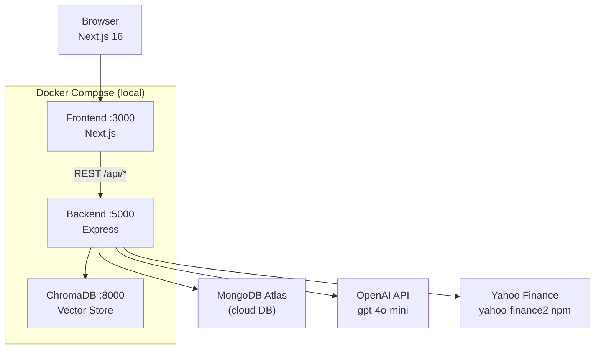
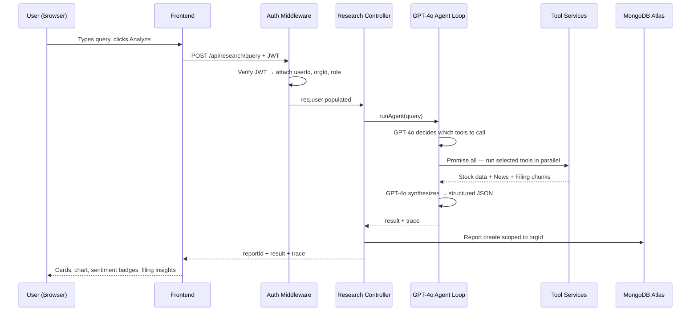
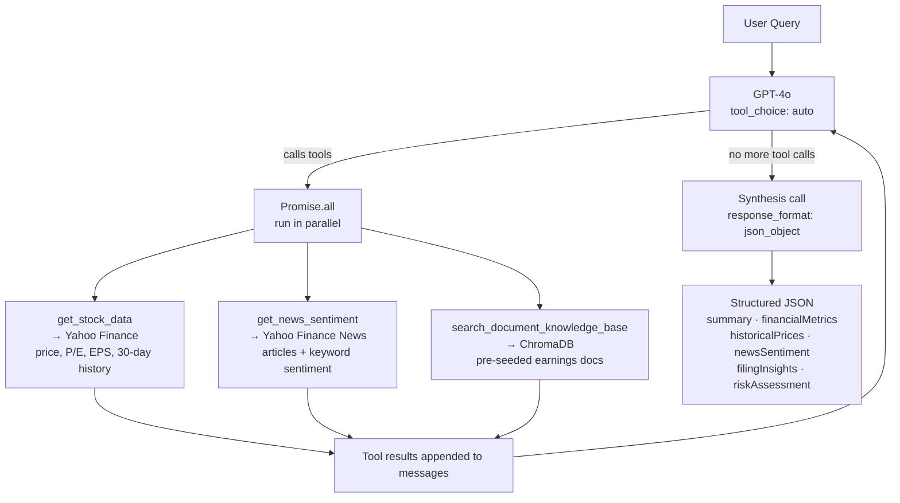
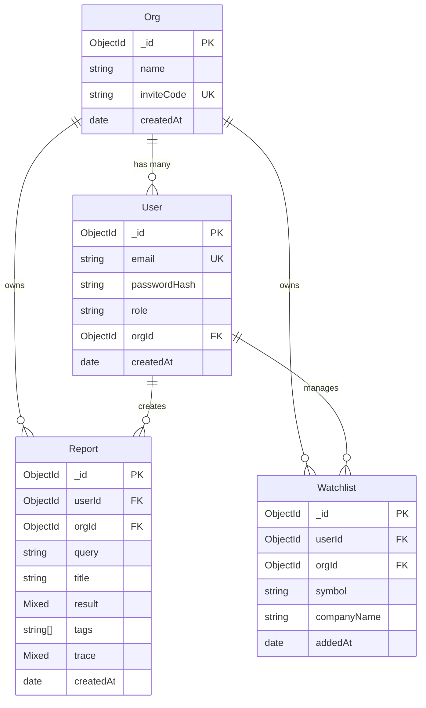
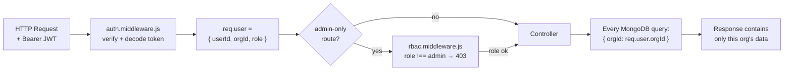

# Architecture — Klypup Investment Research Dashboard

## 1. System Architecture

Three layers: Next.js frontend, Node/Express backend, and three data stores. The browser never calls the AI directly — everything goes through the backend API.



---

## 2. Request → Response Data Flow

How a research query travels through the full system — from typing to rendered results:



---

## 3. AI Agent Orchestration

The agent is a while loop — GPT-4o decides which tools to call, runs them in parallel, then synthesizes everything into a structured JSON report.



**Key point:** `tool_choice: 'auto'` means GPT-4o decides. A simple price query only calls `get_stock_data`. An earnings question calls all three. Tools are never hardcoded.

---

## 4. Database Schema



`role` is `admin` or `analyst`. Every DB query on reports and watchlist is always filtered by `orgId`.

---

## 5. Multi-Tenant Data Isolation

Every request resolves the tenant from the JWT and scopes all DB queries to that org. Org A data never reaches Org B.



**RBAC enforced:**
- `GET /api/org/members` → admin only (analysts get 403)
- `DELETE /api/research/:id` → analyst can only delete their own reports; admin can delete any

---

## 6. API Reference

| Method | Endpoint | Auth | Role | What it does |
|--------|----------|------|------|--------------|
| POST | `/api/auth/signup` | ❌ | — | Create account + org, returns JWT |
| POST | `/api/auth/login` | ❌ | — | Login, returns JWT |
| POST | `/api/org/join` | ❌ | — | Join existing org via invite code, returns JWT |
| GET | `/api/org/me` | ✅ | any | Get current org details |
| GET | `/api/org/members` | ✅ | admin | List all members + invite code |
| POST | `/api/research/query` | ✅ | any | Run AI agent, save + return report |
| GET | `/api/research/history` | ✅ | any | List org reports (supports `?search=`) |
| GET | `/api/research/:id` | ✅ | any | Get single report (org-scoped) |
| PUT | `/api/research/:id` | ✅ | any | Update report title or tags |
| DELETE | `/api/research/:id` | ✅ | any* | Delete report (* analyst: own only) |
| POST | `/api/watchlist` | ✅ | any | Add company to watchlist |
| GET | `/api/watchlist` | ✅ | any | Get watchlist |
| DELETE | `/api/watchlist/:symbol` | ✅ | any | Remove company from watchlist |
| GET | `/api/health` | ❌ | — | Health check |

**Response shape:**
```json
// Success examples
{ "token": "...", "user": { "email": "", "role": "admin" }, "org": { "name": "", "inviteCode": "" } }
{ "report": { "_id": "", "query": "", "result": {}, "trace": {} } }
{ "reports": [ { "_id": "", "title": "", "tags": [], "createdAt": "" } ] }

// Error
{ "error": "descriptive message" }
```
