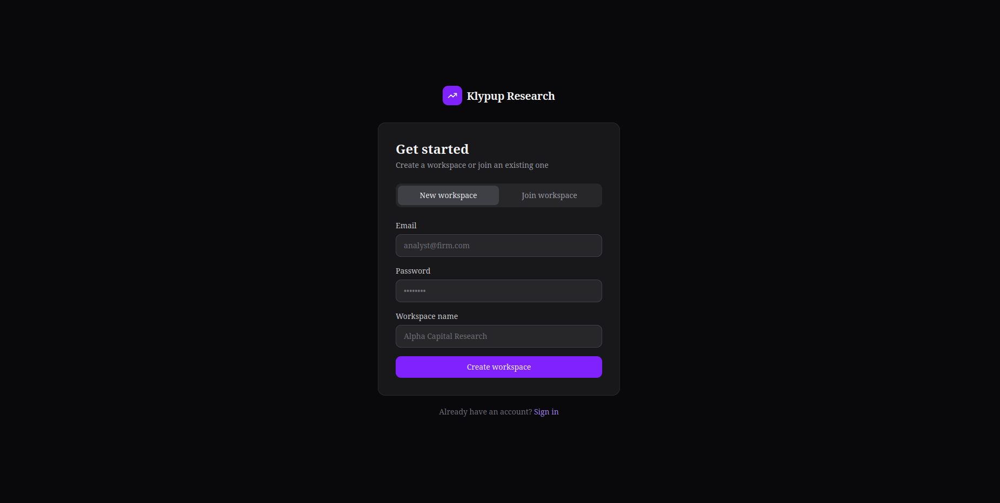
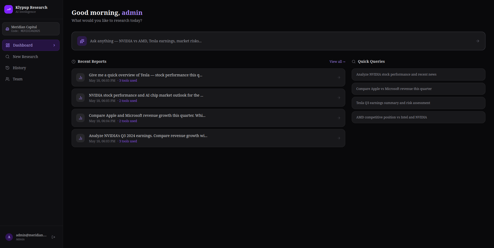
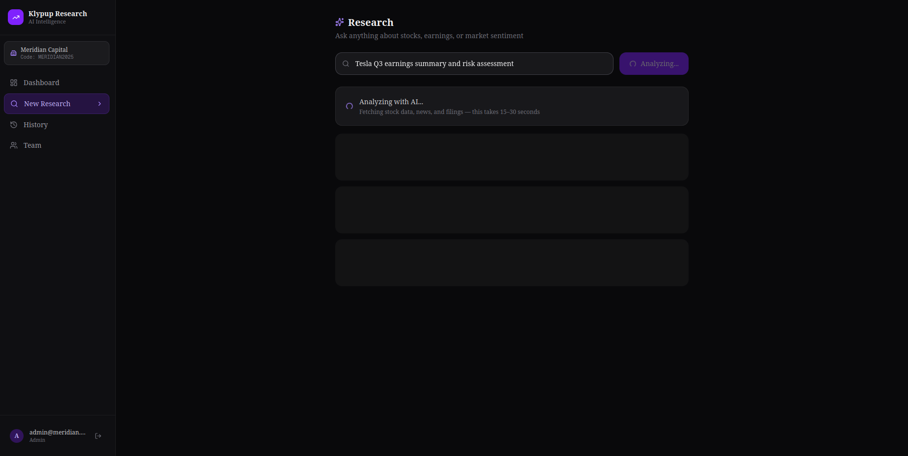
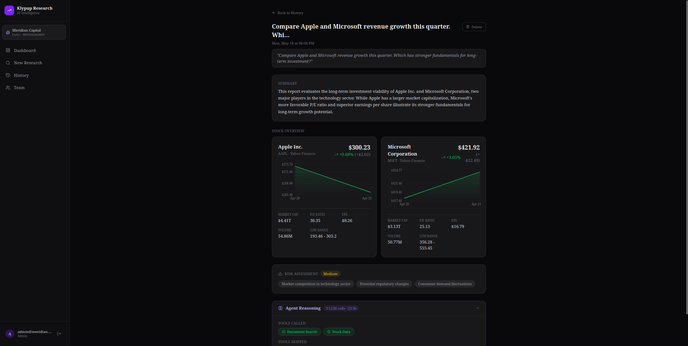
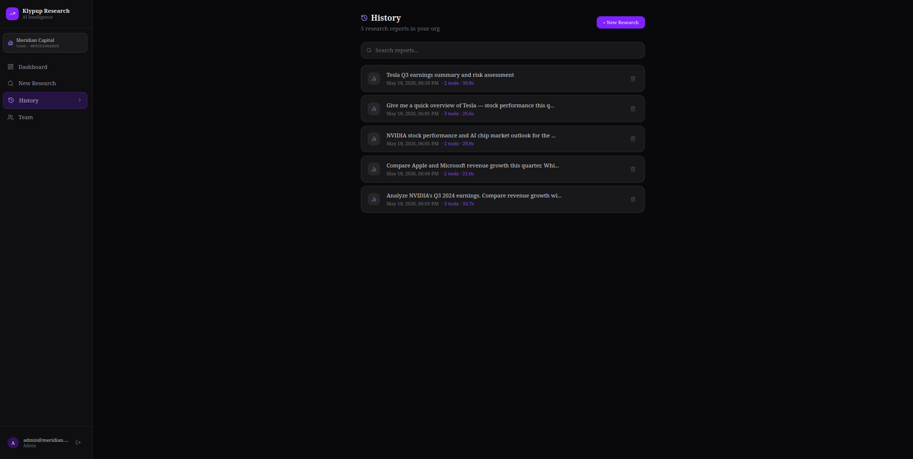
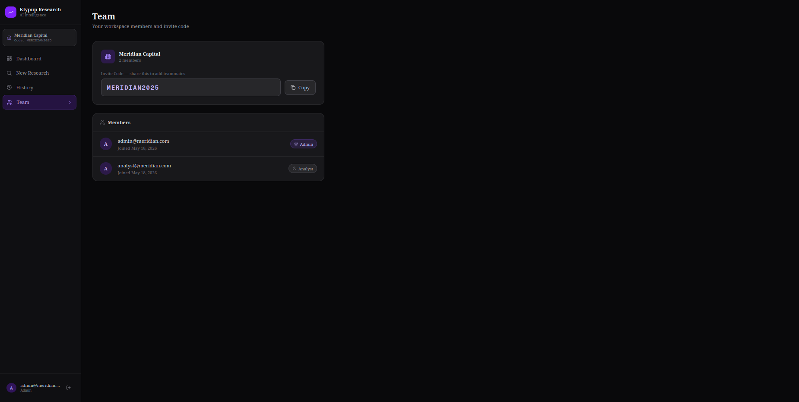

# Klypup Investment Research Dashboard
### Applied AI Intern Assessment — Option A

An AI-powered investment research platform where a GPT-4o agent dynamically decides which tools to call (stock data, news sentiment, earnings filings) based on natural language queries — and returns structured, source-attributed research reports.

---

## Tech Stack

| Layer | Choice | Why |
|-------|--------|-----|
| Frontend | Next.js 16 + Tailwind + shadcn/ui | Fast to build, professional dark UI |
| Backend | Node.js + Express | Clean REST API, easy service separation |
| Database | MongoDB Atlas | Flexible schema, effortless multi-tenancy via orgId |
| AI/LLM | OpenAI GPT-4o (`gpt-4o-mini` dev) | Best-in-class tool calling + structured JSON output |
| Vector DB | ChromaDB | RAG over earnings docs, runs in Docker |
| Stock Data | yahoo-finance2 (npm) | No API key needed, real-time prices + 30-day history |
| News | yahoo-finance2 search | Ticker-specific news, no API key needed |
| Containers | Docker Compose | 3 containers, one-command startup |

---

## How the AI Agent Works

```
User types query
       ↓
GPT-4o reads query + tool definitions
       ↓
Decides which tools to call (NOT hardcoded)
       ↓
Runs all tool calls in PARALLEL
  ├── get_stock_data       → Yahoo Finance (real-time price, P/E, EPS, 30-day history)
  ├── get_news_sentiment   → Yahoo Finance News (articles + keyword sentiment)
  └── search_document_knowledge_base → ChromaDB (earnings reports, 10-K/10-Q)
       ↓
GPT-4o synthesizes all data into structured JSON
       ↓
Report saved to MongoDB (scoped to user's org)
       ↓
Frontend renders: chart + sentiment + filings + reasoning trace
```

The LLM dynamically selects tools — a stock price query only calls `get_stock_data`, an earnings question also calls `search_document_knowledge_base`. The `trace` object returned shows exactly which tools were called vs skipped.

---

## Features

- **AI Research Queries** — natural language → structured report with source attribution
- **30-day Stock Chart** — Recharts AreaChart with green gradient, real data
- **News Sentiment** — per-article + overall positive/neutral/negative classification
- **Filing Insights** — ChromaDB RAG over 5 pre-seeded earnings documents
- **Risk Assessment** — AI-generated risk level (low/medium/high) + factors
- **Agent Reasoning Panel** — shows tools called, tools skipped, LLM calls, duration
- **Report History** — all reports saved per org, searchable, full detail view
- **Multi-tenant Auth** — JWT, org isolation, admin/analyst RBAC
- **Team Management** — invite code, member list, role badges

---

## Project Structure

```
klypup-research-dashboard/
├── docker-compose.yml              ← 3 services: backend, frontend, chromadb
├── documents/                      ← pre-seeded earnings docs for RAG
│   ├── nvidia_q3_2024.txt
│   ├── apple_annual_2024.txt
│   ├── tesla_q3_2024.txt
│   ├── amd_q3_2024.txt
│   └── microsoft_q1_2025.txt
│
├── backend/
│   ├── Dockerfile
│   ├── src/
│   │   ├── services/
│   │   │   ├── agent/
│   │   │   │   ├── agentLoop.js        ← GPT-4o while loop + synthesis
│   │   │   │   ├── toolDefinitions.js  ← JSON schemas for 3 tools
│   │   │   │   └── toolExecutor.js     ← routes tool calls → services
│   │   │   ├── stock.service.js        ← yahoo-finance2: price, metrics, history
│   │   │   ├── news.service.js         ← yahoo-finance2: news + sentiment scoring
│   │   │   └── vectorSearch.service.js ← ChromaDB HTTP client
│   │   ├── controllers/               ← auth, org, research, watchlist
│   │   ├── routes/                    ← REST endpoints
│   │   ├── models/                    ← User, Org, Report, Watchlist
│   │   └── middleware/                ← JWT auth, RBAC
│   └── scripts/
│       └── seedDocuments.js           ← chunks + embeds docs into ChromaDB
│
└── frontend/
    ├── Dockerfile
    └── src/
        ├── app/
        │   ├── dashboard/page.jsx      ← recent reports + quick queries
        │   ├── research/page.jsx       ← main query page + result rendering
        │   ├── history/page.jsx        ← searchable report list
        │   ├── history/[id]/page.jsx   ← single report detail
        │   ├── login/page.jsx
        │   ├── signup/page.jsx
        │   └── team/page.jsx           ← org members + invite code
        └── components/
            ├── CompanyOverviewCard.jsx ← price, chart, 5-metric grid
            ├── StockPriceChart.jsx     ← Recharts AreaChart green gradient
            ├── ReasoningPanel.jsx      ← agent trace (tools called/skipped)
            ├── ResearchResult.jsx      ← assembles all result sections
            └── Sidebar.jsx
```

---

## Screenshots

<table>
  <tr>
    <td align="center"><b>Signup — New or Join Workspace</b></td>
    <td align="center"><b>Dashboard — Recent Reports + Quick Queries</b></td>
  </tr>
  <tr>
    <td></td>
    <td></td>
  </tr>
  <tr>
    <td align="center"><b>AI Analyzing — Live Loading State</b></td>
    <td align="center"><b>Research Results — Stock Cards, Charts, Risk, Reasoning</b></td>
  </tr>
  <tr>
    <td></td>
    <td></td>
  </tr>
  <tr>
    <td align="center"><b>History — Searchable Report List</b></td>
    <td align="center"><b>Team — Org Members + Invite Code (RBAC)</b></td>
  </tr>
  <tr>
    <td></td>
    <td></td>
  </tr>
</table>

---

## Setup & Running

### Prerequisites
- Docker + Docker Compose
- MongoDB Atlas account (free tier works)
- OpenAI API key

### 1. Clone the repo
```bash
git clone https://github.com/Aryan-Elite/klypup-research-dashboard.git
cd klypup-research-dashboard
```

### 2. Configure environment
```bash
cp backend/.env.example backend/.env
```

Edit `backend/.env`:
```env
PORT=5000
MONGODB_URI=mongodb+srv://<user>:<password>@cluster0.xxxxx.mongodb.net/klypup
JWT_SECRET=any_long_random_string

OPENAI_API_KEY=sk-...
OPENAI_MODEL=gpt-4o-mini

CHROMADB_URL=http://chromadb:8000
FRONTEND_URL=http://localhost:3000
```

### 3. Start all containers
```bash
docker compose up --build
```

This starts 3 containers:
- `frontend` → http://localhost:3000
- `backend` → http://localhost:5000
- `chromadb` → http://localhost:8000

### 4. Seed ChromaDB with earnings documents
```bash
docker exec klypup-research-dashboard-backend-1 npm run seed:docs
```

This chunks and embeds 5 company earnings documents (NVIDIA, Apple, Tesla, AMD, Microsoft) into ChromaDB so the agent can search them.

### 5. Open the app
Visit http://localhost:3000 → Sign up → Create an org → Start researching

---

## API Routes

```
POST  /api/auth/signup
POST  /api/auth/login

POST  /api/org/create
POST  /api/org/join           { inviteCode }
GET   /api/org/me
GET   /api/org/members

POST  /api/research/query     → runs agent loop → saves report → returns result + trace
GET   /api/research/history   → org-scoped report list
GET   /api/research/:id
PUT   /api/research/:id       → update tags/title
DELETE /api/research/:id

POST  /api/watchlist
GET   /api/watchlist
DELETE /api/watchlist/:symbol
```

---

## Multi-Tenancy

Every MongoDB query is scoped by `orgId`:
```js
Report.find({ orgId: req.user.orgId })
```
Users belong to one org. Reports, watchlists, and history are completely isolated between orgs. Org A cannot see Org B's data.

Two roles: `admin` (can manage org) and `analyst` (can create/view research).

---

## Demo Workflow

1. Sign up → create **Org A** → note the invite code
2. Open incognito → sign up → join **Org A** with invite code (analyst role)
3. Go to Research → type `"Compare NVIDIA and AMD stock performance"`
4. Watch the agent call `get_stock_data` + `get_news_sentiment` in parallel
5. See the chart, sentiment badges, risk assessment, and reasoning panel
6. Go to History → report is saved and searchable
7. Sign up a third account → create **Org B** → confirm Org A reports are NOT visible

---

## Known Limitations

- News sentiment uses keyword matching (not an LLM) — basic but fast and zero-cost
- Earnings documents are pre-seeded (5 companies). Production would auto-fetch from SEC EDGAR API per ticker on demand
- ChromaDB runs in Docker (self-hosted). Production would use Pinecone or Weaviate Cloud
- `gpt-4o-mini` used by default to keep costs low during dev — switch `OPENAI_MODEL=gpt-4o` for demo
- Research queries take 15–30 seconds (parallel tool calls + 3 LLM calls)
